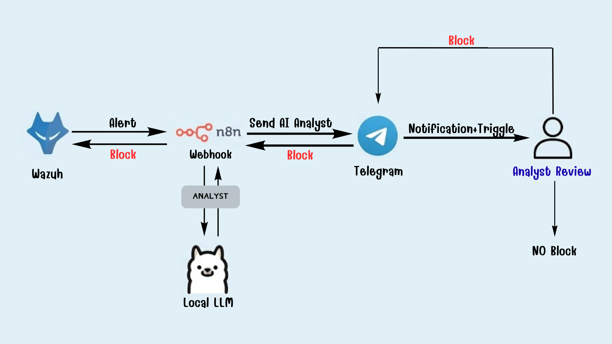

<!-- cSpell:disable -->
<!-- markdownlint-disable -->
# 🛡️ SOAR with Wazuh + n8n + Local LLM

> ⚡ Enterprise-grade Security Orchestration, Automation, and Response — powered by Local LLMs, built for real SOC workflows.

[](https://n8n.io/)
[](https://www.docker.com/)
[](https://wazuh.com/)
[](https://ollama.com/)
[](LICENSE)

---

## Table of Contents

- [Overview](#overview)
- [Key Features](#key-features)
- [Architecture](#architecture)
- [Tech Stack](#tech-stack)
- [Getting Started](#getting-started)
  - [Prerequisites](#prerequisites)
  - [Installation](#installation)
  - [Configuration](#configuration)
- [Usage](#usage)
- [Project Structure](#project-structure)
- [References / Useful Resources](#references--useful-resources)

---

## Overview

**SOAR with Wazuh + n8n + Local LLM** is a fully automated, local-first Security Orchestration, Automation, and Response (SOAR) platform. It connects directly to a live **Wazuh** deployment, continuously monitors high-severity alerts, and uses a **locally-hosted LLM (Llama 3.2 via Ollama)** to perform real-time threat analysis — all without sending sensitive data to external services.

Analysts interact with the system through a purpose-built **Telegram Bot UI**, complete with rich formatting, one-click response actions, and raw log inspection. High-confidence threats are escalated automatically.

> 🔗 Demo on YouTube: *(link coming soon)*
> 📦 Open-source | `the-ai-soar-analyst`



---

## Key Features

| Feature | Description |
|---|---|
| 🔴 Real-time Monitoring | Continuously polls Wazuh Indexer for high-severity security events |
| 🤖 Local AI Analysis | Uses Llama 3.2 (3B) via native Ollama SDK — fully offline, fully private |
| 📲 Telegram SOAR UI | Richly formatted alerts with hashtags, monospaced text, and interactive buttons |
| 🛡️ Acknowledge Alert | Instantly mark alerts as seen and update the audit trail |
| 🚫 Block IP | Trigger Wazuh Active Response to ban malicious source IPs |
| 🔍 View Full Log | Retrieve raw JSON metadata directly in Telegram for deep-dive analysis |
| ⚡ Auto-Escalation | High-confidence threats (>90% AI score) trigger immediate host isolation |
| 🔀 Zero-Code Automation | Powered by n8n for highly visual, maintainable, and flexible workflows |

---

## Architecture

The system operates on a containerized microservices architecture designed for clarity and extensibility:

```text
                 ┌─────────────────────────────────────────────┐
                 │              Wazuh Deployment                │
                 │   Manager :55000        Indexer :9200        │
                 └──────────────┬──────────────────────────────┘
                                │ Alerts (Webhook)
                                ▼
                 ┌─────────────────────────────────────────────┐
                 │                n8n Workflow                  │
                 │        Receives webhook & orchestrates       │
                 └──────────┬─────────────────┬────────────────┘
                            │                 │
              ┌─────────────▼───┐   ┌─────────▼──────────────┐
              │  Wazuh API Node │   │     Ollama Node         │
              │  (Active        │   │  (llama3.2 JSON         │
              │   Response)     │   │   enforced output)      │
              └─────────────────┘   └────────────┬───────────┘
                                                 │ AI Decision
                                    ┌────────────▼───────────┐
                                    │    Telegram Node        │
                                    │  Interactive Bot UI     │
                                    │  + Analyst Review       │
                                    └────────────────────────┘
```

### Module Responsibilities

- **`docker-compose.yml`** — Deploys n8n and Ollama within a secure isolated internal network.
- **`n8n/workflow_ai_soar.json`** — The core SOAR automation logic that connects Wazuh, Llama 3.2, and Telegram.
- **`wazuh_integration_snippet.xml`** — Configuration to forward Wazuh alerts to the n8n Webhook.

---

## Tech Stack

| Layer | Technology |
|---|---|
| SIEM / EDR | [Wazuh](https://wazuh.com/) 4.x |
| Local LLM | [Ollama](https://ollama.com/) + `llama3.2:3b` |
| Orchestration | [n8n](https://n8n.io/) |
| Notification | [Telegram Bot API](https://core.telegram.org/bots/api) |
| Containerization | Docker & Docker Compose |

---

## Getting Started

### Prerequisites

Before running the project, ensure the following services are available and accessible:

- ✅ **Docker & Docker Compose**: Installed on your host machine.
- ✅ **Wazuh**: Manager installed and accessible on your network.
- ✅ **Telegram Bot**: Created via [@BotFather](https://t.me/BotFather) with a valid token and chat ID.

---

### Installation

```bash
# 1. Clone the repository
git clone https://github.com/Taeaps561/AI-SOAR-Docker.git
cd AI-SOAR-Docker

# 2. Start the SOAR infrastructure
docker-compose up -d

# 3. Download the Llama 3.2 model into the Ollama container
docker exec -it ai_soar_ollama ollama pull llama3.2
```

---

### Configuration

#### 1. n8n Configuration
1. Open your browser and navigate to `http://localhost:5678`.
2. Complete the initial Owner setup.
3. Go to **Workflows** -> **Add Workflow** -> **Import from File**.
4. Select the `n8n/workflow_ai_soar.json` file.
5. Double-click the **Telegram** nodes to add your Bot Token and Chat ID.
6. Double-click the **Execute Block IP** node to insert your Wazuh API Token.
7. Toggle the workflow to **Active**.

#### 2. Wazuh Integration
Add the following block to your Wazuh Manager's `ossec.conf` to forward alerts to n8n:
```xml
<integration>
  <name>custom-n8n</name>
  <hook_url>http://[N8N_IP]:5678/webhook/wazuh-webhook</hook_url>
  <level>7</level>
  <alert_format>json</alert_format>
</integration>
```
Restart the Wazuh Manager to apply changes.

---

## Usage

Once running and configured, the system will automatically:

1. Receive Wazuh alerts with severity ≥ 7 via Webhook into n8n.
2. Send each alert to Ollama for AI-powered threat analysis.
3. Deliver a formatted alert card to your Telegram chat.
4. Wait for your interactive response (Ignore, Block IP) directly from Telegram.

---

## Project Structure

```text
AI-SOAR-Docker/
│
├── docker-compose.yml        # Docker deployment configuration
├── n8n/
│   └── workflow_ai_soar.json # n8n visual workflow blueprint
├── wazuh_integration_snippet.xml # Wazuh to n8n Webhook configuration
├── user_manual_ENG.md        # User Guide (English)
├── user_manual_TH.md         # User Guide (Thai)
└── README.md
```

---

## References / Useful Resources

- [n8n Documentation](https://docs.n8n.io/)
- [Wazuh Documentation](https://documentation.wazuh.com/)
- [Ollama API Reference](https://github.com/ollama/ollama/blob/main/docs/api.md)
- [Telegram Bot API](https://core.telegram.org/bots/api)

---

## My Notes

> 📝 This project was built as a hands-on learning exercise in AI-assisted SOC workflows, combining SIEM integration, local LLM inference, and interactive n8n-based SOAR response. Contributions and feedback are welcome.

---

## License

MIT License. Created for SOC Analysts by **The AI-SOAR Team**.

---

*Built with ❤️ for defenders, by defenders.*
